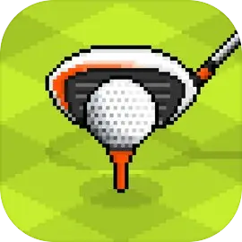
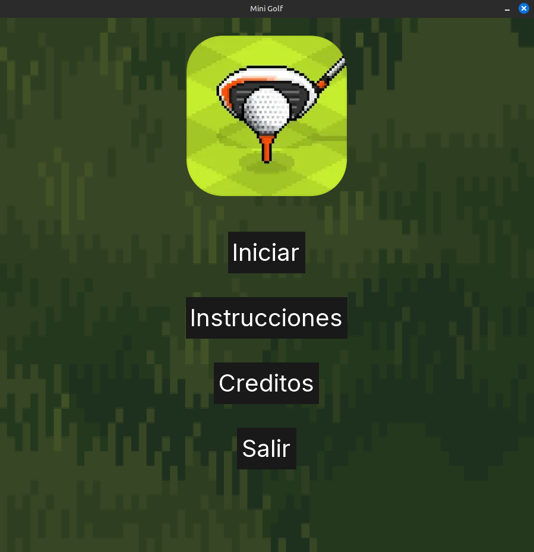
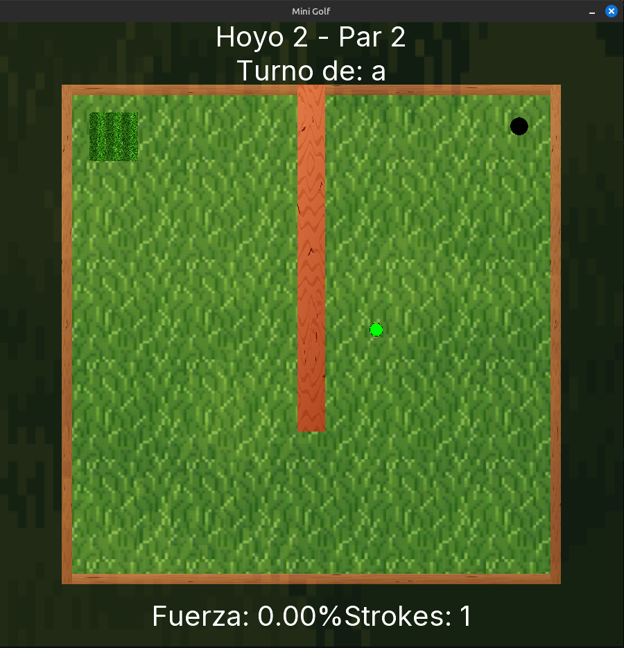
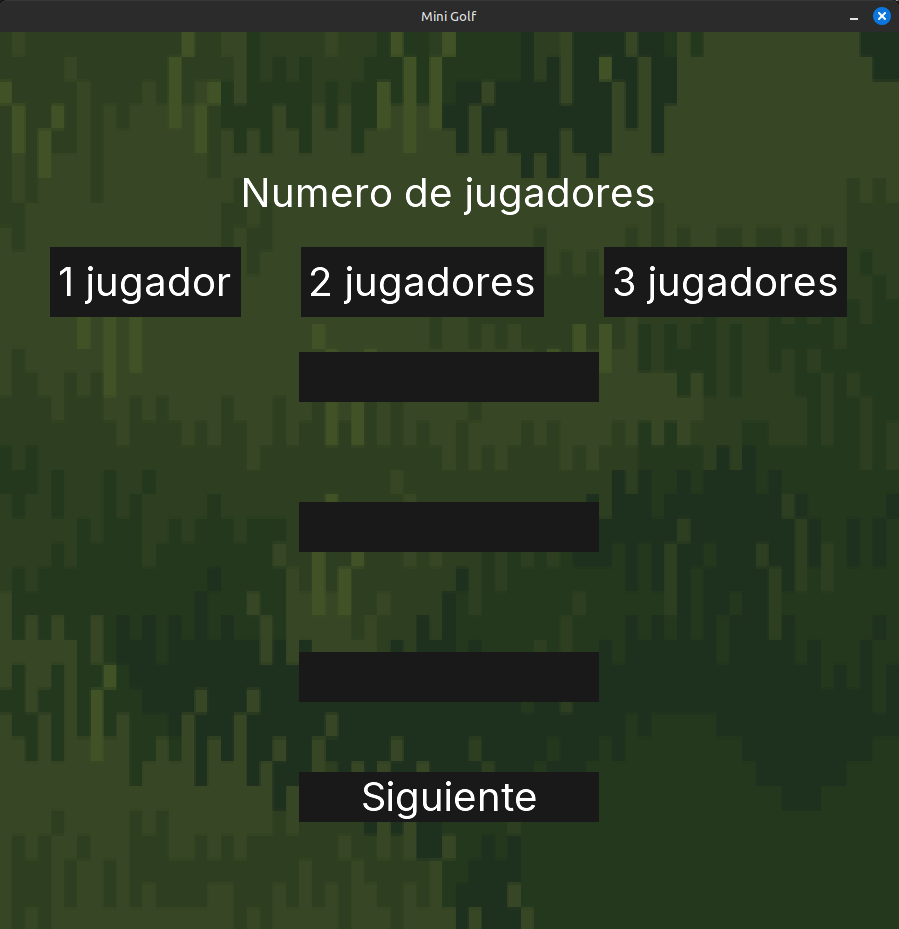
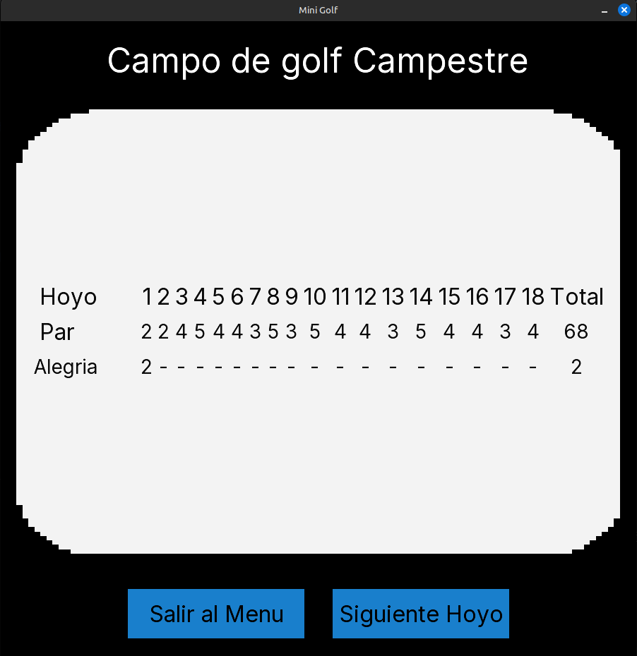

# 🏌️ Mini Golf Game

[](https://www.oracle.com/java/)
[](https://libgdx.com/)
[](https://box2d.org/)
[](https://gradle.org/)
[](LICENSE)
[]()

Un juego de mini golf multijugador desarrollado en Java utilizando el framework LibGDX y el motor de física Box2D. Cuenta con física realista, múltiples niveles, sistema de turnos y efectos de audio inmersivos.

<div align="center">
  
</div>

## 📸 Capturas de Pantalla

<div align="center">
  <table>
    <tr>
      <td align="center">
        
        <br><b>Menú Principal</b>
      </td>
      <td align="center">
        
        <br><b>Jugabilidad</b>
      </td>
    </tr>
    <tr>
      <td align="center">
        
        <br><b>Selección de Colores</b>
      </td>
      <td align="center">
        
        <br><b>Tabla de Puntuaciones</b>
      </td>
    </tr>
  </table>
</div>

## 📋 Descripción

Mini Golf Game es un juego de golf en miniatura que permite a múltiples jugadores competir en diversos niveles con obstáculos únicos. El juego cuenta con física realista, efectos de sonido inmersivos y una interfaz de usuario intuitiva.

### ✨ Características Principales

- 🎮 **Multijugador**: Soporte para múltiples jugadores en turnos
- 🎯 **18 Niveles**: Diversos campos de mini golf con dificultad progresiva
- 🎨 **Colores Personalizados**: Cada jugador puede elegir el color de su pelota
- 🔊 **Efectos de Sonido**: Audio inmersivo para colisiones y eventos del juego
- ⚡ **Zonas Especiales**: Elementos de aceleración que modifican el movimiento de la pelota
- 📊 **Sistema de Puntuación**: Conteo de golpes (strokes) por jugador y nivel
- 🖼️ **Gráficos 2D**: Texturas y fondos personalizados para una experiencia visual atractiva

## 🛠️ Tecnologías Utilizadas

### Framework Principal
- **[LibGDX](https://libgdx.com/)**: Framework de desarrollo de juegos multiplataforma
- **[Box2D](https://box2d.org/)**: Motor de física 2D para simulación realista

### Lenguaje y Herramientas
- **Java**: Lenguaje de programación principal
- **Gradle**: Sistema de construcción y gestión de dependencias
- **FreeType**: Renderizado de fuentes TTF
- **OpenGL**: Renderizado gráfico acelerado por hardware

## 🎮 Cómo Jugar

### Controles
- **Click Izquierdo**: Colocar pelota en el punto de inicio
- **Flechas Izquierda/Derecha**: Ajustar dirección del golpe
- **Flechas Arriba/Abajo**: Ajustar fuerza del golpe
- **Barra Espaciadora**: Ejecutar el golpe

### Objetivo
El objetivo es llevar la pelota desde el punto de inicio hasta el hoyo en el menor número de golpes posible. Cada jugador toma turnos y el jugador con menos golpes totales al final de todos los niveles gana.

## 🚀 Inicio Rápido

### 📋 Requisitos del Sistema
- **Java Development Kit (JDK)**: 8 o superior
- **Memoria RAM**: Mínimo 512MB, recomendado 1GB
- **Espacio en Disco**: 100MB para instalación
- **Sistema Operativo**: Windows, Linux, macOS
- **OpenGL**: Soporte para OpenGL 2.0+

### 🔧 Instalación Detallada

1. **Clonar el repositorio**
   ```bash
   git clone https://github.com/tu-usuario/Mini-Golf.git
   cd Mini-Golf
   ```

2. **Navegar al directorio del proyecto**
   ```bash
   cd proyectoGradle
   ```

3. **Ejecutar el juego**
   ```bash
   # Linux/Mac
   ./gradlew lwjgl3:run
   
   # Windows
   gradlew.bat lwjgl3:run
   ```

## 📁 Estructura del Proyecto

```
proyectoGradle/
├── assets/                     # Recursos del juego
│   ├── *.png                  # Texturas e imágenes
│   ├── *.mp3                  # Efectos de sonido
│   ├── fonts/                 # Fuentes TTF
│   └── ui/                    # Elementos de interfaz
├── core/                      # Lógica principal del juego
│   └── src/main/java/com/minigolf/
│       ├── screens/           # Pantallas del juego
│       ├── models/            # Modelos de datos
│       ├── handlers/          # Manejadores de eventos y colisiones
│       └── niveles/           # Definiciones de niveles
├── lwjgl3/                    # Configuración de desktop
└── gradle/                    # Configuración de Gradle
```